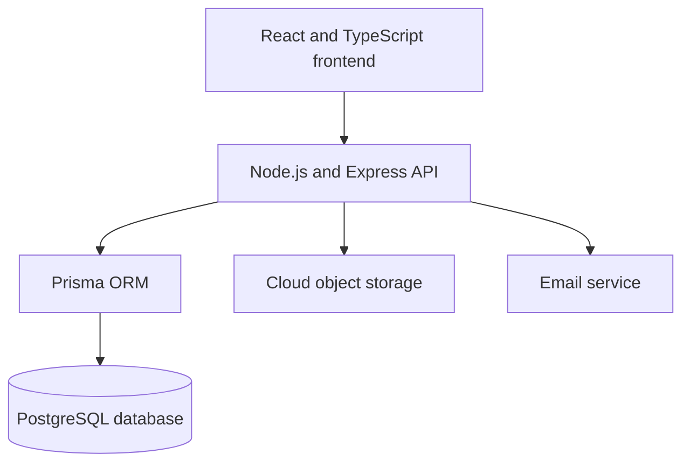

# Spring Otters Logistics

**Full-stack logistics marketplace connecting shippers with verified transporters across Tanzania.**

[View Live Website](https://www.springotterslogistics.com/)

> This repository is a public portfolio case study. Production source code, credentials, internal API implementation and user data are intentionally kept private.

## Project Overview

Spring Otters Logistics is a role-based web platform designed to modernize cargo transportation management in Tanzania.

The platform allows shippers to publish loads, receive transport offers and manage shipments. Transporters can register vehicles, complete document verification, find available loads and negotiate with shippers. Administrators manage user, document and vehicle verification processes.

## My Role

I designed and implemented the platform as a full-stack web application.

My responsibilities included:

* product requirements and workflow design;
* frontend development with React and TypeScript;
* backend API development with Node.js and Express;
* PostgreSQL database design using Prisma ORM;
* authentication and role-based authorization;
* shipper, transporter and administrator dashboards;
* document and vehicle verification workflows;
* notification and negotiation functionality;
* multilingual interface implementation;
* cloud deployment and production configuration;
* technical documentation and ongoing maintenance.

## User Roles

| Role          | Main capabilities                                                                                        |
| ------------- | -------------------------------------------------------------------------------------------------------- |
| Shipper       | Create and manage loads, review transport offers, negotiate, confirm shipments and leave reviews         |
| Transporter   | Register vehicles, submit verification documents, find available loads, send offers and manage shipments |
| Administrator | Review accounts, documents and vehicles, approve or reject applications and manage platform activity     |

## Core Features

### Account and Access Management

* shipper and transporter registration;
* secure sign-in and sign-out;
* Google authentication;
* password reset by email;
* role-based protected routes;
* account verification statuses;
* document resubmission after rejection;
* verification history.

### Shipper Dashboard

* create, edit, cancel and close loads;
* define cargo, route, dates and vehicle requirements;
* receive offers from transporters;
* negotiate through an internal chat;
* accept a selected transport offer;
* manage active and completed shipments;
* leave a review after delivery.

### Transporter Dashboard

* browse available loads;
* submit transport offers;
* manage negotiations;
* select an approved vehicle for a shipment;
* track active and completed shipments;
* receive account and vehicle notifications;
* review shippers after completed delivery.

### Vehicle Verification

* register trucks and trailers;
* upload vehicle photographs;
* upload registration documents;
* upload insurance documents;
* submit LATRA licence information;
* monitor document expiry dates;
* automatically restrict expired vehicles;
* administrator approval, rejection and update requests.

### Administration

* separate transporter and shipper management;
* account approval, rejection and suspension;
* document verification;
* vehicle verification;
* verification history;
* user profile review;
* platform activity monitoring.

### Notifications

The platform provides in-app notifications for:

* account verification updates;
* vehicle verification updates;
* new negotiation messages;
* accepted or rejected offers;
* shipment status changes;
* completed deliveries;
* new reviews;
* expiring vehicle documents.

## Main Workflows

### Shipper

1. Create an account.
2. Submit business verification documents.
3. Receive administrator approval.
4. Publish a load.
5. Receive and compare transport offers.
6. Negotiate with a transporter.
7. Accept an offer and create a shipment.
8. Confirm delivery.
9. Leave a review.

### Transporter

1. Create an account.
2. Submit company and transport documents.
3. Receive administrator approval.
4. Add a vehicle and submit its documents.
5. Receive vehicle approval.
6. Browse available loads.
7. Send an offer and negotiate with the shipper.
8. Complete the shipment.
9. Leave a review.

## System Architecture

## Technology Stack

| Area                 | Technologies                                                |
| -------------------- | ----------------------------------------------------------- |
| Frontend             | React, TypeScript, Vite, Tailwind CSS                       |
| Backend              | Node.js, Express, TypeScript                                |
| Database             | PostgreSQL, Prisma ORM                                      |
| Authentication       | JWT, HTTP-only cookies, bcrypt, Google authentication       |
| File storage         | Cloudflare R2-compatible object storage                     |
| Deployment           | Railway, custom domain and production environment variables |
| Internationalization | English and Swahili                                         |
| Version control      | Git and GitHub                                              |

## Security and Privacy Measures

* passwords are hashed before storage;
* authentication uses protected HTTP-only cookies;
* server-side role and ownership checks protect private operations;
* password reset tokens are hashed and time-limited;
* sensitive authentication endpoints use request limits;
* uploaded documents are handled through controlled storage workflows;
* expired insurance and LATRA documents prevent vehicle approval;
* production secrets are stored in environment variables;
* production user data is not included in this repository.

## Project Status

* live web application available at [springotterslogistics.com](https://www.springotterslogistics.com/);
* functional MVP deployed to production;
* active development and testing;
* production source repository remains private.

## Repository Scope

This public repository exists to demonstrate the project architecture, implemented functionality and my contribution to the product.

It does not contain:

* production source code;
* environment variables or credentials;
* internal API routes;
* database migrations;
* customer information;
* uploaded business or vehicle documents.

## Contact

**Antanina Sinitskaya**

[LinkedIn](https://www.linkedin.com/in/antanina-sinitskaya-283bab2b5/)
[Live Project](https://www.springotterslogistics.com/)
